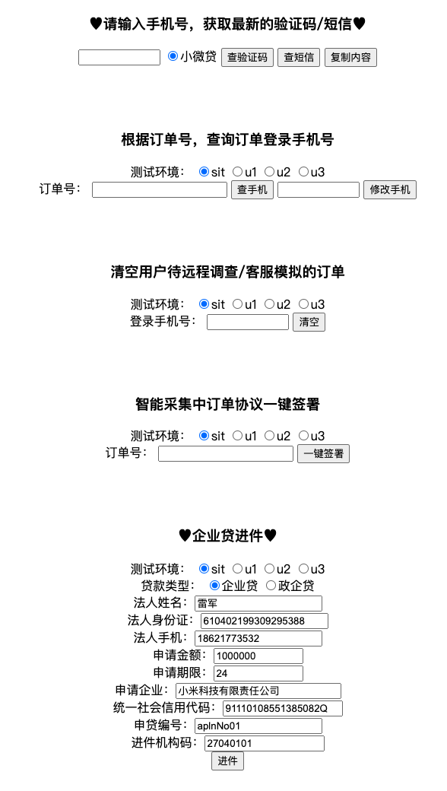

# 短信验证码获取
> 可以自动获取多个环境的验证码，并且取最新的返回到页面。

# 使用
重命名server.json.example 为 server.json
修改数据库连接和sql

编译（或者直接使用bin文件夹里面的版本）
```code
#编译Linux版本
CGO_ENABLED=0 GOOS=linux GOARCH=amd64 go build  -o ./bin/verification2_linux verification2.go
#编译mac版本
CGO_ENABLED=0 GOOS=darwin GOARCH=amd64 go build  -o ./bin/verification2_mac verification2.go
#编译windoes版本
CGO_ENABLED=0 GOOS=windows GOARCH=amd64 go build  -o ./bin/verification2.exe verification2.go
```
# 运行
#Linux后台运行
nohub ./verification2 &

打开环境链接 http://{ip}:{port}/


# 界面
